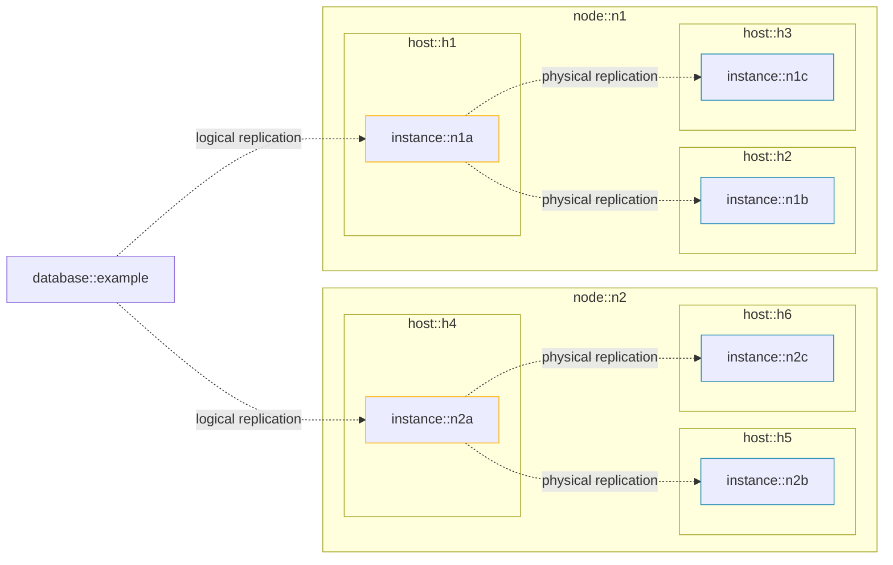

# Concepts

The pgEdge Control Plane is designed to simplify the management and orchestration of Postgres databases. It provides a declarative API for defining, deploying, and updating databases across multiple hosts.

This section introduces the core concepts and terminology used throughout the Control Plane documentation to help you understand how databases, nodes, and instances interact within a cluster.

The above diagram demonstrates the relationship between databases, nodes, and
instances in a cluster: a database is composed of one or more nodes, and each node is composed of one or more instances.

## Hosts

Hosts are the underlying compute resources used to run database instances. One Control Plane server should be deployed to each host that will run databases. For this reason, each Control Plane server is identified by a host ID.

## Cluster

A Cluster represents a collection of hosts that are joined together to provide a unified API for managing databases. Connecting the Control Plane server on each host into a cluster enables coordination and orchestration of resources, allowing databases to be deployed, replicated, and managed across hosts.

## Databases

A database in the Control Plane API is a PostgreSQL database that is optionally replicated between multiple PostgreSQL instances. A database is composed of one or more [nodes](#nodes).

You create and update databases by submitting a "database spec"
to the Control Plane API. See [Creating a Database](guides/create-db.md) and
[Updating a Database](guides/update-db.md) for more information.

## Nodes

pgEdge uses an extension, called [Spock](https://github.com/pgEdge/spock), to
replicate data between PostgreSQL instances using logical replication. In the Control Plane API, nodes refer to Spock nodes. 

Each node is composed of one or more PostgreSQL [instances](#instances), where one instance is a primary and the others are read replicas. Writes can be made to the primary instance of any node in the database.

## Instances

Unless clarified, Instances in the Control Plane API refers to PostgreSQL
instances. For a given node, one instance is created for each host specified in
the `host_ids` array. 

When a node which has multiple instances is created, the primary instance for the node will be set to the first host in the `host_ids` array. After the database is created, the primary instance may change due to a failover or switchover operation. 

## Orchestrators

The Control Plane is architected to support various orchestrators, allowing for flexible deployment and management of database instances. At present, Docker Swarm is the only supported orchestrator, enabling containerized deployment of databases across multiple hosts.

For the Docker Swarm orchestrator, each host corresponds to a Docker Swarm node, with the Control Plane running as a Docker container. Each database instance runs as a separate Docker container within the Swarm environment. 

We plan to support additional orchestration approaches in the near future, including direct deployment to hosts without containerization.