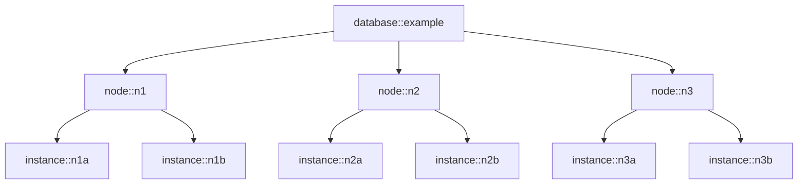

# Concepts

The pgEdge Control Plane is designed to simplify the management and orchestration of Postgres databases. It provides a declarative API for defining, deploying, and updating databases across multiple hosts.

This section introduces the core concepts and terminology used throughout the Control Plane documentation to help you understand how databases, nodes, and instances interact within the system.

The above diagram demonstrates the relationship between databases, nodes, and
instances: a database is composed of one or more nodes, and each node is
composed of one or more instances.

## Hosts

Hosts are the underlying compute resources used to run database instances. For
Docker Swarm, each host is a Docker Swarm node. One Control Plane instance
should be deployed to each host that will run databases. For this reason, each
Control Plane instance is identified by a host ID.

## Databases

A database in the Control Plane API is a PostgreSQL database that is replicated
between multiple PostgreSQL instances. A database is composed of one or more
[nodes](#nodes). You create and update databases by submitting a "database spec"
to a declarative API. See [Creating a database](guides/create-db.md) and
[Updating a database](guides/update-db.md) for more about the database API.

## Nodes

pgEdge uses an extension, called [Spock](https://github.com/pgEdge/spock), to
replicate data between PostgreSQL instances. In the Control Plane API, "nodes"
refer to Spock nodes. Each node is composed of one or more PostgreSQL
[instances](#instances), where one instance is a primary and the others are read
replicas. Writes can be made to the primary instance of any node in the
database.

## Instances

Unless clarified, "instances" in the Control Plane API refers to PostgreSQL
instances. For a given node, one instance is created for each host specified in
the `host_ids` array. When a node has multiple instances, one instance will be
elected as the primary, and the others will serve as read-only replicas. In
Docker Swarm, each instance is a separate Docker container.
